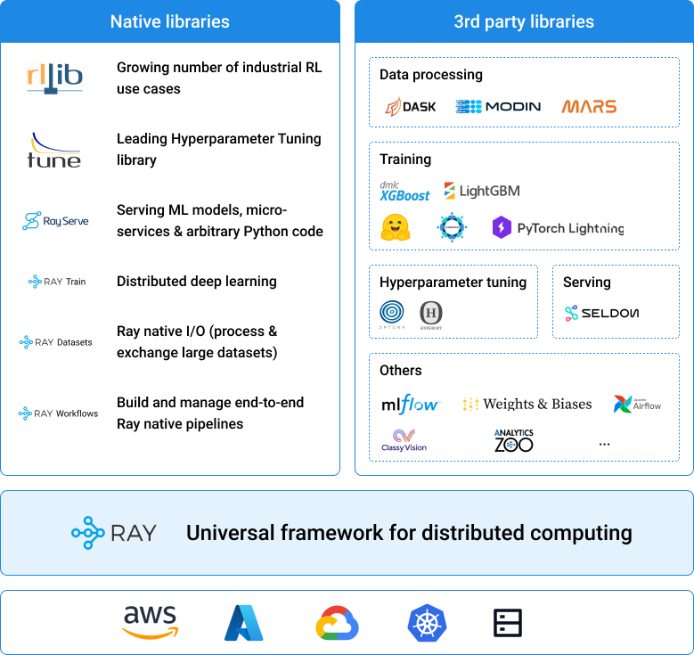

# Welcome to the Ray documentation

```{image} https://github.com/ray-project/ray/raw/master/doc/source/images/ray_header_logo.png
```

```{image} https://readthedocs.org/projects/ray/badge/?version=master
:target: http://docs.ray.io/en/master/?badge=master
```

```{image} https://img.shields.io/badge/Ray-Join%20Slack-blue
:target: https://forms.gle/9TSdDYUgxYs8SA9e8
```

```{image} https://img.shields.io/badge/Discuss-Ask%20Questions-blue
:target: https://discuss.ray.io/
```

```{image} https://img.shields.io/twitter/follow/raydistributed.svg?style=social&logo=twitter
:target: https://twitter.com/raydistributed
```

## What can you do with Ray?


````{panels}
:container: +full-width text-center
:column: col-lg-4 px-2 py-2
:card:

**Build distributed applications with Core**
^^^
Ray Core provides a [simple and flexible API](ray-core/walkthrough.rst) for building and running your distributed applications.
You can often parallelize single machine code with little to zero code changes.

For instance, with Ray Core you can easily parallelize your functions using 
[Ray Tasks](ray-core/walkthrough.rst#remote-functions-tasks) or your classes using 
[Ray Actors](ray-core/actors.rst). 
+++
```{link-button} ray-core/walkthrough
:type: ref
:text: Get Started with Ray Core
:classes: btn-outline-info btn-block
```
---
**Run machine learning workflows with ML**
^^^
With Ray ML you can run tasks like [distributed data loading and compute](data/dataset.rst),
[distributed deep learning](train/train.rst),
[scalable hyperparameter tuning](tune/index.rst),
or [industry-grade reinforcement learning](rllib/index.rst).

For production, Ray ML offers [scalable model serving](serve/index.rst) 
and [fast, durable application flows](workflows/concepts.rst).

+++
```{link-button} ray-overview/index
:type: ref
:text: Get Started with Ray ML
:classes: btn-outline-info btn-block
```

---
**Deploy large-scale workloads with Clusters**
^^^
With Ray Clusters you can deploy your workloads on [AWS, GCP, Azure](cluster/quickstart) or 
[on premise](cluster/cloud.html#cluster-private-setup). The [Ray auto-scaler](cluster/sdk)
 and Ray runtime handle the scheduling, distributing, and fault-tolerance needs of your application.

You can also use [Ray Cluster Managers](cluster/deploy) to run Ray on your existing
[Kubernetes](cluster/kubernetes),
[YARN](cluster/yarn),
or [Slurm](cluster/slurm) clusters.
+++

```{link-button} cluster/quickstart
:type: ref
:text: Get Started with Ray Clusters
:classes: btn-outline-info btn-block
```
````

## What is Ray?

Ray is an open-source project developed at UC Berkeley RISE Lab.
As a general-purpose and universal distributed compute framework, you can flexibly run any compute-intensive Python workload — from distributed training or hyperparameter tuning to deep reinforcement learning and production model serving.
To help you, Ray Core provides a simple, universal API for building distributed applications.
And Ray's native libraries and tools enable you to run complex ML applications with Ray.
You can deploy these applications on any of the major cloud providers, including AWS, GCP, and Azure, or run them on your own servers.
Ray also has a growing [ecosystem of community integrations](ray-overview/ray-libraries), including [Dask](https://docs.ray.io/en/latest/data/dask-on-ray.html), [MARS](https://docs.ray.io/en/latest/data/mars-on-ray.html), [Modin](https://github.com/modin-project/modin), [Horovod](https://horovod.readthedocs.io/en/stable/ray_include.html), [Hugging Face](https://huggingface.co/transformers/main_classes/trainer.html#transformers.Trainer.hyperparameter_search), [Scikit-learn](ray-more-libs/joblib), [and others](ray-more-libs/index).
The following figure gives you an overview of the Ray ecosystem.




## How to get involved?

Ray is more than a framework for distributed applications but also an active community of developers, researchers, and folks that love machine learning.
Here's a list of tips for getting involved with the Ray community:


```{admonition} Get involved and become part of the Ray community
:class: tip

💬 [Join our community](https://forms.gle/9TSdDYUgxYs8SA9e8): 
Discuss all things Ray with us in our community Slack channel or use our 
[discussion board](https://discuss.ray.io/) to ask questions and get answers.

💡 [Open an issue](https://github.com/ray-project/ray/issues/new/choose): 
Help us improve Ray by submitting feature requests, bug-reports, or simply ask for help and get support via GitHub issues.

👩‍💻 [Create a pull request](https://github.com/ray-project/ray/pulls): 
Found a typo in the documentation? Want to add a new feature? Submit a pull request to help us improve Ray.

🐦 [Follow us on Twitter](https://twitter.com/raydistributed): 
Stay up to date with the latest news and updates on Ray.

⭐ [Star and follow us on GitHub](https://github.com/ray-project/ray): 
Support Ray by following its development on GitHub and give us a boost by starring the project.

🤝🏿 [Join our Meetup Group](https://www.meetup.com/Bay-Area-Ray-Meetup/): 
Join one of our community events to learn more about Ray and get a chance to meet the team behind Ray.

🙌 [Discuss on Stack Overflow](https://stackoverflow.com/questions/tagged/ray): 
Use the `[ray]` tag on Stack Overflow to ask and answer questions about Ray usage.
```

If you're interested in contributing to Ray, check out our [contributing guide](ray-contribute/getting-involved)
to read about the contribution process and see what you can work on!


## What documentation resource is right for you?


````{panels}
:container: +full-width text-center
:column: col-lg-6 px-2 py-2
:card:

---
**Getting Started**


^^^^^^^^^^^^^^^

If you're new to Ray, check out the getting started guide.
You will learn how to install Ray, how to compute an example with the Ray Core API, and how to use each of Ray's ML libraries.
You will also understand where to go from there.

+++

```{link-button} ray-overview/index
:type: ref
:text: Getting Started Guide
:classes: btn-block btn-outline-info stretched-link
```

---
**User Guides**


^^^^^^^^^^^

Our user guides provide you with in-depth information about how to use Ray's libraries and tooling.
You will learn about the key concepts and features of Ray and how to use them in practice.
+++

{link-badge}`ray-core/using-ray.html,"Ray Core",cls=badge-info text-white`
{link-badge}`train/user_guide.html,"Ray Train",cls=badge-info text-white`
{link-badge}`tune/user-guide.html,"Ray Tune",cls=badge-info text-white`
{link-badge}`serve/tutorial.html,"Ray Serve",cls=badge-info text-white`
{link-badge}`cluster/user-guide.html,"Ray Clusters",cls=badge-info text-white`
---
**API reference**


^^^^^^^^^^^^^

Our API reference guide provides you with a detailed description of the different Ray APIs.
It assumes familiarity with the key concepts and gives you information about functions, classes, and methods.

+++

```{link-button} ray-references/api
:type: ref
:text: Reference Guides
:classes: btn-block btn-outline-info stretched-link
```

---
**Developer guides**


^^^^^^^^^^^^^^^

You need more information on how to debug or profile Ray?
You want more information about Ray's internals?
Maybe you saw a typo in the documentation, want to fix a bug or contribute a new feature? 
Our developer guides will help you get started.

+++

```{link-button} ray-contribute/getting-involved
:type: ref
:text: Developer Guides
:classes: btn-block btn-outline-info stretched-link
```

````